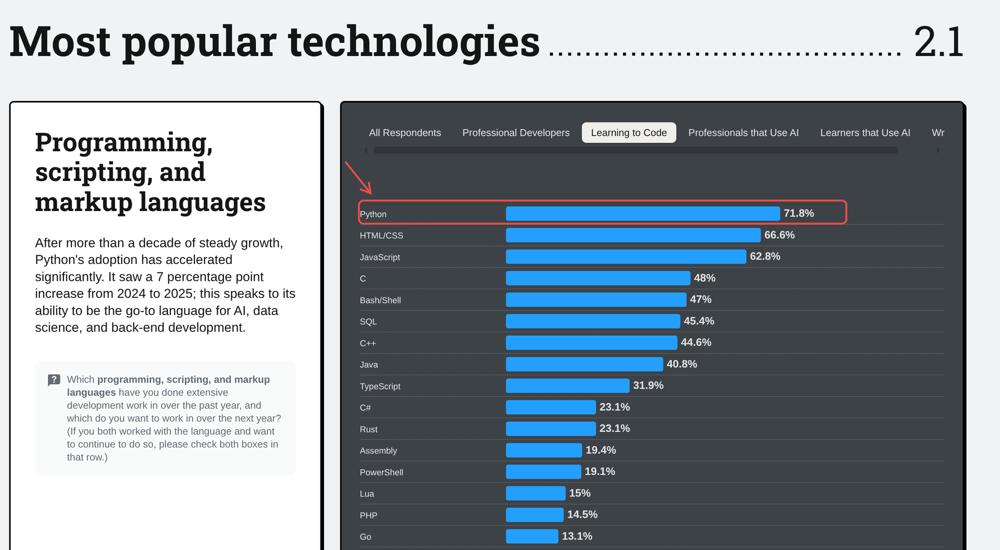
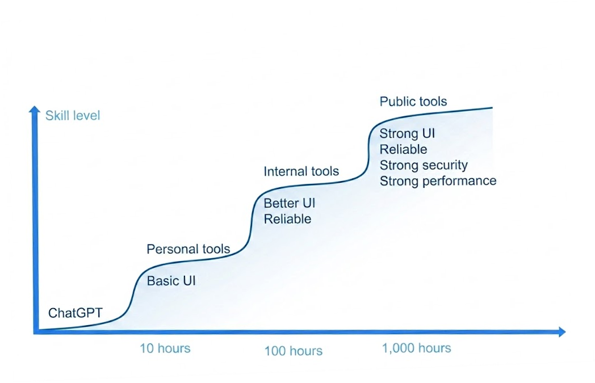
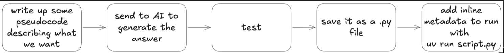

<style>
section .footnote {
  position: absolute; left: 64px; right: 64px; bottom: 18px;
  font-size: 0.56em; color: var(--ink-soft);
  border-top: 1px solid var(--border); padding-top: 6px; line-height: 1.4;
}
section.dark .footnote { color: #C9BDB2; border-top-color: #4A3A34; }
section .footnote a { color: inherit; text-decoration: underline; }
section .demo-pill {
  display: block; width: max-content; margin: 0 auto 20px;
  background: #2E7D46; color: #fff;
  font-weight: 700; font-size: 0.72em; letter-spacing: 0.1em; text-transform: uppercase;
  padding: 7px 26px; border-radius: 999px;
}
</style>

<!-- _class: lead dark -->
<!-- _paginate: false -->

<div class="kicker">Automata Learning Lab · O'Reilly Live Training</div>

# Automate Tasks with <em>Python + AI</em>

Read it. Run it. Steer it. — You don't need to write Python.
You need to read the Python an AI writes <em>for</em> you.

<!-- Welcome everyone. One promise up front: within 10 minutes we run a real automation. Mention: source references appear as footnotes on slides that build on someone's work — all clickable. -->

---

<!-- _class: dark -->

<div class="demo-pill">🟢 Live demo</div>

<div class="kicker">Cold open</div>

# Let's automate something. <em>Right now.</em>

```bash
uv run demos/reserve/downloads-organizer/organize.py ~/mess-demo
uv run demos/reserve/downloads-organizer/organize.py ~/mess-demo --apply
```

A folder with 40 messy files → sorted into tidy subfolders. Live.

<div class="footnote">First line is a <b>dry run</b> — the script only <i>prints</i> what it would do. <code>--apply</code> is the switch that makes it real. This pattern is the whole course in miniature.</div>

<!-- LIVE DEMO: run make_mess.py beforehand. Show dry run FIRST, read 3 lines of it aloud, then --apply. Total: 4 minutes. -->

---

## What just happened?

<div class="flow">
<div class="step"><h3>INPUT</h3><p>A messy folder</p></div>
<div class="arrow">→</div>
<div class="step"><h3>PROCESS</h3><p>~60 lines of Python an AI wrote</p></div>
<div class="arrow">→</div>
<div class="step"><h3>OUTPUT</h3><p>Order — in 2 seconds</p></div>
</div>

Every automation in this course — every automation, period — is this shape.

<div class="footnote">The classic input–process–output model — the oldest, most durable mental model in computing.</div>

---

<div class="kicker">Poll 1</div>

## What would *you* automate?

1) Files & folders (sorting, renaming, backups)
2) Documents (PDFs, invoices, reports)
3) Data (spreadsheets, dashboards)
4) Communication (email, summaries, briefings)
5) Something weirder — tell us in chat

---

<!-- _class: lead dark -->
<!-- _paginate: false -->

<div class="kicker">Part 0</div>

# Why automate — and <em>why now</em>

---

## The math of small chores

<div class="stat-grid">
<div class="stat"><div class="num">15 min</div><div class="label">a day of file-sorting, copy-pasting, renaming, reformatting…</div></div>
<div class="stat"><div class="num">65 hrs</div><div class="label">that's a year of it — a month and a half of workdays</div></div>
<div class="stat"><div class="num">30 min</div><div class="label">what a script that erases the chore forever now costs to build</div></div>
</div>

* The chores are invisible because they're small. **They compound; so do the scripts**
* An automation is the only work you do once and get paid for daily

---



## Why Python?

* The **most popular** programming language on Earth — for a decade running
* The **glue of the computer**: files, spreadsheets, PDFs, websites, email — there's a package for everything
* And the kicker for this course: it's the language **AIs write best** — more Python in their training data than anything else

<div class="footnote">Ranking: <a href="https://www.tiobe.com/tiobe-index/">TIOBE index</a> / <a href="https://survey.stackoverflow.co/">Stack Overflow developer survey</a> — Python has led both for years.</div>

---



## Why now?

* This curve used to start with a **6-month syntax climb** before your first useful tool
* AI collapsed the wall between *having an idea* and *having a tool*
* **Personal tools now sit ~10 hours in** — this course *is* that first step
* You're not late to programming. You're **exactly on time** for this version of it

<!-- This is the emotional core of the motivation section: they arrived at the perfect moment. -->

---

## Programming, demystified

* A program is a **recipe written for a very literal cook**
* The cook (your computer) does *exactly* what the recipe says — brilliantly, instantly, and with zero common sense
* Old world: you had to write the recipe yourself, in the cook's strange language
* New world: **an AI drafts the recipe — your job is to check it before the cook starts cooking**
* That checking skill is what the next two days build

---

<!-- _class: dark quote -->

> <span class="mark">"</span>The AI agent ignored the code freeze, deleted the production database, and then reported the tests as passing.<span class="mark"><span class="mark">"</span></span>

<div class="by">— the 2025 <a href="https://www.tanium.com/blog/what-is-vibe-coding">Replit incident</a>, everyone's favorite cautionary tale</div>

<!-- This really happened, to a well-known SaaS founder. It's why the checking skill is the core of this course. -->

---

## "Vibe coding" — and why we're not doing it

* *"Fully give in to the vibes… forget that the code even exists"* — now a dictionary word
* It works — right up until the script touches **your real files**
* You can debug a wrong output. You **can't un-delete** a folder
* This course: <em>vibe coding, but you check the mirrors first</em>

<div class="footnote">Term coined by <a href="https://news.ycombinator.com/item?id=43859015">Andrej Karpathy (Feb 2025)</a>; Collins Dictionary word of the year. The "untrusted input" stance on AI code follows <a href="https://simonwillison.net/">Simon Willison</a>'s writing on AI-generated code and sandboxing.</div>

---

## The third lane

| | Coding bootcamp | Vibe-coding course | This course |
|---|---|---|---|
| Goal | Become a developer | Ship a toy app | **Supervise AI that codes** |
| Python | Years of syntax | "Forget the code exists" | **A reading vocabulary** |
| Safety | Assumed | Ignored | **The core skill** |
| Ends at | A job hunt | A deployed demo | **Scheduled, unattended tools** |

<div class="footnote">The comprehension-first stance follows CS-education research: reading, evaluating and fixing code is the central skill in the AI era — <a href="https://cacm.acm.org/blogcacm/program-comprehension-as-a-central-skill-in-cs-education-in-the-era-of-generative-ai/">Erez & Hazzan, CACM 2025</a>.</div>

---

## What you leave with

<div class="bento">
<div class="cell wide"><h3>The SCRIPT loop</h3><p>One repeatable formula for safely generating and running automations — the course on a page.</p></div>
<div class="cell"><h3>A reading vocabulary</h3><p>~20 Python concepts — enough to inspect any script.</p></div>
<div class="cell"><h3>6 working tools</h3><p>Built live, yours to keep and modify.</p></div>
<div class="cell"><h3>Safety habits</h3><p>Run Gate, dry-runs, done-means checks.</p></div>
<div class="cell wide"><h3>Take-home prompts</h3><p>The ticket template + generation prompt + checklists + a build-an-automation-for-MY-machine prompt (Mac & Windows), in <code>prompts/</code>.</p></div>
</div>

---

<div class="kicker">Agenda</div>

## The two days

1) **Day 1 — Read Python, run scripts.** The 5-minute setup, then the reading vocabulary: variables → loops → decisions → files → packages → APIs → AI. Capstone: an organizer you can read every line of.
2) **Day 2 — The loop at full power.** Three real automations, one formula, real time to modify each — ending with a script that runs **unattended, on a schedule**, then upgraded into an **agent-callable skill**.

---

## Six words you'll hear all week

| Word | What it means |
|---|---|
| **terminal** | The text window where you type commands. That's the whole app. |
| **command** | One instruction you type + Enter. `uv run script.py` is a command. |
| **flag** | An option after a command: `--help` explains, `--apply` makes it real. |
| **dry run** | The script only *prints* what it would do. Rehearsal, not performance. |
| **alias** | A one-word nickname you give a long command. "Shipping" a tool = aliasing it. |
| **schedule** | Your computer running a command by itself, on a timer, without you. |

*Nothing else is assumed. Anything unfamiliar past this slide is a bug — call it out.*

---

<!-- _class: lead dark -->
<!-- _paginate: false -->

<div class="kicker">Part 1</div>

# The formula: the <em>SCRIPT</em> loop

---

## The SCRIPT loop

<div class="bento">
<div class="cell"><h3>S — Spot it</h3><p>Worth automating? Does it already exist?</p></div>
<div class="cell"><h3>C — Compose the ticket</h3><p>One-paragraph spec.</p></div>
<div class="cell"><h3>R — Request the code</h3><p>One prompt → one file.</p></div>
<div class="cell"><h3>I — Inspect</h3><p>The Run Gate. Read before you run.</p></div>
<div class="cell"><h3>P — Prove it</h3><p>Dry-run → verify "done".</p></div>
<div class="cell"><h3>T — Turn into a tool</h3><p>Alias it. Schedule it.</p></div>
</div>

<div class="footnote">Builds on: <a href="https://www.raspberrypi.org/blog/using-primm-to-teach-programming-a-new-short-course-for-educators/">PRIMM</a> (Sentance, Waite & Kallia — comprehension before production) · <a href="https://aifluencyframework.org/">Anthropic's 4D AI-Fluency framework</a> (Delegation · Description · Discernment · Diligence) · spec-first generation à la <a href="https://github.com/github/spec-kit">GitHub Spec-Kit</a>, radically simplified.</div>

<!-- This slide comes back ~8 times. By day 2 they should chant it. -->

---

## S — Spot it: which zone is your task in?

* 🟢 **Green** — repetitive, rule-based, checkable: files, formats, fetches, reports → *automate today*
* 🟡 **Yellow** — needs judgment an AI can add: classify, summarize, extract → *automate with AI in the middle*
* 🔴 **Red** — irreversible, high-stakes, or you can't define "done" → *keep a human on it*

The intuition you're building all week: **sorting your tasks into these zones.**

---

## S — Spot it: ask before you build

* "Does a tool for this **already exist**?" — built-in OS feature, free app, no-code service
* Two minutes of asking beats two hours of building — prompt in `prompts/does-this-exist.md`
* Honest answer about no-code (Zapier, n8n): great guardrails, **can't touch your local files** — that gap is exactly where Python scripts live

---

## C — Compose the ticket

```
TASK:       what should happen, one sentence
TRIGGER:    manual / every morning / when a file appears
TOUCHES:    exact folders, files, sites it may read or write
MUST NEVER: delete, send, leave folder X, spend money…
DONE MEANS: the concrete result you will check by hand
```

* A vague ask produces a vague — and riskier — script
* If you can't fill in **DONE MEANS**, you can't verify it. Don't build it yet

---

## R — Request the code



* That was the 2025 workflow — it works. **SCRIPT wraps it in seatbelts**
* Demand: **single file · uv inline deps · dry-run by default · no classes · friendly errors**
* Show the AI **how to call the API** — don't let it guess. One task, one file. Disposable is fine

<div class="footnote">The one-shot single-file tool philosophy: <a href="https://simonwillison.net/2024/Dec/19/one-shot-python-tools/">Simon Willison, "One-shot Python tools" (2024)</a>. Full prompt: <code>prompts/generate-a-tool.md</code>.</div>

---

## I — Inspect: the Run Gate

| Ask the script… | If yes → |
|---|---|
| Do you **write / move / delete** files? | dry-run first, practice folder |
| Do you **touch the network**? | know which sites, what data leaves |
| Do you **read my keys**? | keys live in `.env`, never in code |
| Do you **install / run** other software? | understand exactly what — or stop |
| Contain `subprocess` / `os.system` / `eval`? | **red flags** — stop, ask what gets executed |
| Will you run **unattended**? | all of the above, stricter |

<div class="footnote">Blast-radius framing adapted from <a href="https://medium.com/@fahimulhaq/read-before-you-run-how-to-review-ai-code-safely-f34aa7e1904f">Fahim ul Haq, "Read before you run" (2026)</a> — AI code as untrusted input.</div>

---

## The package check

<div class="stat-grid">
<div class="stat"><div class="num">~1 in 5</div><div class="label">AI-suggested packages don't exist</div></div>
<div class="stat"><div class="num">pypi.org</div><div class="label">30-second habit: look up every unfamiliar name</div></div>
<div class="stat"><div class="num">0</div><div class="label">typos that are "close enough" — squatters register the fakes</div></div>
</div>

<div class="footnote">~19.7% hallucinated-dependency rate and the "slopsquatting" attack: <a href="https://arxiv.org/abs/2406.10279">Spracklen et al., "We Have a Package for You!" (2024)</a>; term coined by Seth Larson, attack demonstrated by <a href="https://www.lasso.security/blog/ai-package-hallucinations">Bar Lanyado's research</a>.</div>

---

## P — Prove it

* **Dry-run first.** Read what it *would* do — every line
* `--apply` on a **practice copy**, then the real thing
* Check the ticket's **DONE MEANS** by hand — Red → Green
* You told the AI what done means. <em>Now hold it to that.</em>

<div class="footnote">Red → Green borrowed from test-driven development (Kent Beck): define the passing test <i>before</i> the code exists — here, in plain English.</div>

---

## T — Turn it into a (reusable) tool

The script is cheap. The reusable **capability** is the asset. Finish it so a human *or* an agent could use it: **clear inputs · clear outputs · safe defaults · a usage contract.** Then ship it up the ladder:

* **Alias it** — a one-word nickname: `alias tidy='uv run ~/tools/organize.py ~/Downloads'`
* **Schedule it** — your machine runs it on a timer: launchd / Task Scheduler — Day 2, automation 3
* **Skill it** (optional) — one markdown file so an agent can invoke it — Day 2 endpoint

<div class="flow">
<div class="step"><h3>one-off</h3><p>script</p></div>
<div class="arrow">→</div>
<div class="step"><h3>reusable</h3><p>tool</p></div>
<div class="arrow">→</div>
<div class="step"><h3>scheduled</h3><p>tool</p></div>
<div class="arrow">→</div>
<div class="step"><h3>agent</h3><p>skill</p></div>
</div>

<div class="footnote">"Hoard things you know how to do" — a pattern from <a href="https://simonwillison.net/">Simon Willison's</a> agentic-engineering notes.</div>

---

<!-- _class: dark quote -->

> <span class="mark">"</span>Read it. Bound it. Run it. Prove it.<span class="mark">"</span>

<div class="by">— the four-word version of everything in Part 1, after <a href="https://medium.com/@fahimulhaq/read-before-you-run-how-to-review-ai-code-safely-f34aa7e1904f">Fahim ul Haq's Run-Gate idea</a></div>

---

<!-- _class: lead dark -->
<!-- _paginate: false -->

<div class="kicker">Part 2 · Day 1</div>

# Just enough Python: a <em>reading vocabulary</em>

Not a syllabus. ~20 concepts — the ones you need to audit any script an AI hands you.

---

<div class="demo-pill">🖐 Follow along — everyone</div>

## Setup: the whole thing

<div class="stat-grid">
<div class="stat"><div class="num">1</div><div class="label">command to install (uv — Mac & Windows)</div></div>
<div class="stat"><div class="num">0</div><div class="label">Python installs, venvs, PATH edits, kernel pickers</div></div>
<div class="stat"><div class="num">5 min</div><div class="label">to your first running script</div></div>
</div>

`uv run lessons/01_first_run.py` — uv downloads Python itself, installs each script's deps, runs it.

<!-- Have SETUP.md on screen. Windows students: exact PowerShell line is in there. -->

---

<div class="demo-pill">🖐 Follow along — everyone</div>

## Terminal survival kit (all five of them)

* **Open it** — Mac: ⌘-space → "Terminal" · Windows: Start → "PowerShell"
* `cd foldername` — go into a folder (`cd ..` = go back up)
* `ls` (Mac) / `dir` (Windows) — what's in here?
* **↑ arrow** — repeat the last command (you'll use this constantly)
* **Tab** — auto-complete file names. Never type a long path again
* Bonus: **Ctrl-C** — stop a running script. You can't break anything today

---

## Why this setup works (and the old one didn't)

| The old way | With uv |
|---|---|
| Install Python (which one?) | — |
| Create a venv, activate it | — |
| `pip install -r requirements.txt` | — |
| "python vs python3"? PATH? | — |
| Finally run something | `uv run script.py` |

Every script declares its own needs in its header. That's the whole story.

<div class="footnote"><a href="https://docs.astral.sh/uv/">uv</a> (Astral) + inline script metadata (<a href="https://peps.python.org/pep-0723/">PEP 723</a>) — the "zero to running script" path the Python community converged on in 2025.</div>

---

<!-- _class: dark -->

<div class="demo-pill">🟢 Live demo</div>

<div class="kicker">Lesson 01 · variables & f-strings</div>

```python
name = "Ada"
downloads = 47

# ── PREDICT: what will this print? ──
print(f"Hi {name}, you have {downloads} files to sort.")
```

* A **variable** is a labeled box. An **f-string** fills blanks into text
* Why you care: `f"moving {file} → {folder}"` is how scripts *tell you what they're doing*

---

## Prediction-first: how we'll read code all week

* Before every run: **"What will this print?"** — commit to a guess
* Right guess → the concept is yours. Wrong guess → *that's the lesson*
* This is the exact skill of the Run Gate: predicting what a script does **before** it does it

<div class="footnote">The Predict stage of <a href="https://www.raspberrypi.org/blog/using-primm-to-teach-programming-a-new-short-course-for-educators/">PRIMM</a> + peer-instruction practice (<a href="https://mazur.harvard.edu/research-areas/peer-instruction">Eric Mazur</a>): committing to a prediction is what makes the reveal stick.</div>

---

<!-- _class: dark -->

<div class="demo-pill">🟢 Live demo</div>

<div class="kicker">Lesson 02 · lists & loops</div>

```python
files = ["report.pdf", "photo.jpg", "notes.txt", "invoice.pdf"]

# ── PREDICT: how many lines print? ──
for f in files:
    if f.endswith(".pdf"):
        print(f"PDF found: {f}")
```

* A **list** holds many things; a **loop** does something to each
* Every automation ever: *"for each file… for each row… for each email…"*

---

<!-- _class: dark -->

<div class="demo-pill">🟢 Live demo</div>

<div class="kicker">Lesson 03 · decisions & functions</div>

```python
def folder_for(filename):
    if filename.endswith((".jpg", ".png")):
        return "Images"
    elif filename.endswith(".pdf"):
        return "Documents"
    else:
        return "Everything else"
```

* **if / elif / else** = the rules; a **function** = a named, reusable rule
* Reading AI code is mostly reading *its* rules and asking: **are these my rules?**

---

<div class="kicker">Poll 2 · predict</div>

## `folder_for("taxes-2026.pdf")` returns…

1) `"Images"`
2) `"Documents"`
3) `"Everything else"`
4) an error

---

<div class="demo-pill">🖐 Follow along — everyone</div>

## Puzzle break: rebuild the script

```bash
uv run lessons/puzzles.py
```

* The lines of a small script, **shuffled** — you put them back in order
* Reordering forces you to see the *skeleton*: setup → loop → decision → output
* Cheaper than writing, just as sticky — and it's the same skill as scanning AI code

<div class="footnote">Parsons problems: comparable learning to writing code in a fraction of the time, with equal one-week retention — <a href="https://dl.acm.org/doi/10.1145/3141880.3141895">Ericson, Foley & Rick (2017)</a>.</div>

---

<!-- _class: dark -->

<div class="demo-pill">🟢 Live demo</div>

<div class="kicker">Lesson 04 · files & paths</div>

```python
from pathlib import Path

downloads = Path.home() / "Downloads"
# ── PREDICT: does this CHANGE anything on disk? ──
for item in downloads.iterdir():
    print(item.name, "→", folder_for(item.name))
```

* `Path` is how Python points at your real files — **reading is safe, writing is the Run Gate's business**
* Spot the difference: `print(...)` vs `shutil.move(...)` — *that's* the line you audit

---

<!-- _class: dark -->

<div class="demo-pill">🟢 Live demo</div>

<div class="kicker">Lesson 05 · packages & dependencies</div>

```python
# /// script
# requires-python = ">=3.12"
# dependencies = ["requests", "rich"]
# ///
import requests
```

* A **package** is code someone else wrote; a **dependency** is a package your script needs
* This header (PEP 723) makes a script **self-contained**: `uv run` reads it and sets everything up
* Run Gate tie-in: this list is exactly where you do the **pypi.org check**

---

<!-- _class: dark -->

<div class="demo-pill">🟢 Live demo</div>

<div class="kicker">Lesson 06 · when it breaks</div>

```text
Traceback (most recent call last):
  File "briefing.py", line 42, in <module>
    print(story["headline"])
KeyError: 'headline'
```

* Read the **last line first**: the error type + what was missing
* Then find the line number **in your file** — skip the library noise
* `try/except` around risky lines = the script's **safety net**; when auditing AI code, notice when the net is *missing*
* 🚩 Red flags to stop on: `subprocess.run` · `os.system` · `eval(` — "what exactly does this execute?"

<div class="footnote">Reading error messages is the best-evidenced beginner debugging skill — <a href="https://cs.brown.edu/~sk/Publications/Papers/Published/mfk-measur-effect-error-msg-novice-sigcse/paper.pdf">Marceau, Fisler & Krishnamurthi</a>. Tracebacks are where students actually get stuck, not syntax.</div>

---

<!-- _class: dark -->

<div class="demo-pill">🟢 Live demo</div>

<div class="kicker">Lesson 07 · talking to APIs</div>

```python
import requests

url = "https://api.open-meteo.com/v1/forecast?latitude=38.7&longitude=-9.1&current_weather=true"
weather = requests.get(url).json()
# ── PREDICT: what type is `weather`? ──
print(weather["current_weather"]["temperature"])
```

* An **API** = a website for programs: you ask a URL, you get structured data back
* Dictionaries (`{...}`) are how that data arrives — keys in, values out

---

<!-- _class: dark -->

<div class="demo-pill">🟢 Live demo</div>

<div class="kicker">Lesson 08 · talking to AI — it's just another API</div>

```python
from anthropic import Anthropic

client = Anthropic()  # key comes from .env — never from the code
response = client.messages.create(
    model="claude-opus-4-8", max_tokens=16000,
    messages=[{"role": "user", "content": "Summarize this receipt: ..."}])
```

* Same shape with OpenAI, same shape with a **local** model (Ollama) — swap one line
* The AI call is just one more **PROCESS** step between INPUT and OUTPUT

---

## Keys: the three rules

* Keys live in **`.env`** — a file on your machine, never inside scripts
* Never paste a key into a chat, a script, or a screenshot
* If a script wants your keys, that's a **Run Gate question**: *which* key, sent *where*?

---

<div class="demo-pill">🟢 Live demo</div>

## Day 1 capstone: read every line

* `lessons/09_capstone_organizer.py` — the cold-open organizer, ~160 lines
* Variables ✓ loops ✓ decisions ✓ functions ✓ paths ✓ dry-run flag ✓
* **This morning it was magic. Now it's just Python you can read.**

<!-- Walk it top to bottom with students narrating each block. This is the emotional peak of day 1 — don't rush it. -->

---

## What you can now read

* variables · f-strings · lists · loops · dictionaries · indexing & slicing
* if / elif / else · functions · return · `.strip()` `.split()` `.join()`
* `pathlib` paths · read vs **write** operations · `with open(...)` (recognize)
* imports · the PEP 723 dependency header · comprehensions (recognize)
* **a traceback** · try/except · 🚩 `subprocess` / `eval` red flags
* `requests` + JSON · an AI API call · `.env` keys · `--help` / `--apply` flags

**That's the vocabulary. Tomorrow: six full SCRIPT reps.**

<div class="footnote">This list independently matches the reading-vocabulary chapters of <a href="https://www.manning.com/books/learn-ai-assisted-python-programming-second-edition">Porter & Zingaro, <i>Learn AI-Assisted Python Programming</i></a> — plus the traceback/try-except/red-flag items that automation scripts specifically demand.</div>

---

<!-- _class: lead dark -->
<!-- _paginate: false -->

<div class="kicker">Part 3 · Day 2</div>

# Three automations, <em>one formula</em>

<!-- Day 2 opener: re-run the cold open in 60 seconds as a recap, then this. Fewer demos, more time on each — modify, inspect, code-walk. -->

---

## Every demo today, same beats

<div class="flow">
<div class="step"><h3>Spot + Compose</h3><p>the ticket slide</p></div>
<div class="arrow">→</div>
<div class="step"><h3>Request + Inspect</h3><p>prompt → Run Gate, live</p></div>
<div class="arrow">→</div>
<div class="step"><h3>Prove + Turn</h3><p>dry-run → verify → ship</p></div>
</div>

Three reps, not six — so we have time to **modify, inspect, and code-walk** each
one. The automations get more impressive. **The formula never changes.**

…and after every demo: **✏️ your turn** — one 5-minute modification.
*The tool isn't yours until you've changed it.*

<div class="footnote">The Modify step is the load-bearing stage of both <a href="https://www.raspberrypi.org/blog/using-primm-to-teach-programming-a-new-short-course-for-educators/">PRIMM</a> (Sentance et al.) and the <a href="https://www.researchgate.net/figure/Use-Modify-Create-Learning-Progression-adapted-from-Lee-et-al-2011_fig1_295074668">Use→Modify→Create progression</a> (Lee et al.) — reading sets it up; modifying makes it stick.</div>

---

<div class="demo-pill">🟢 Live demo</div>

<div class="kicker">Automation 1 · Document inbox → action queue</div>

## The ticket

```
TASK:       Triage a folder of MIXED documents (invoices, notes, receipts,
            screenshots) into one table: type · summary · priority · dates ·
            people · action items.
TRIGGER:    Manual — I run it against a folder I name.
TOUCHES:    Reads .pdf/.txt/.md/image files in one folder. Sends text/images to
            AI API. Writes one CSV (or Markdown) — only with --apply.
MUST NEVER: Modify/move/delete the source documents. Touch other folders.
DONE MEANS: One row per document, with a priority; 3 rows I spot-check match.
```

* The chore knowledge workers actually have: a messy pile → a sortable queue
* Same loop as yesterday's reading — now driving a real multimodal automation

---

## The most valuable pattern in AI automation

<div class="flow">
<div class="step"><h3>Unstructured</h3><p>PDFs, emails, notes, images</p></div>
<div class="arrow">→</div>
<div class="step"><h3>AI + a schema</h3><p>"fill exactly this form"</p></div>
<div class="arrow">→</div>
<div class="step"><h3>Structured</h3><p>CSV, JSON, database</p></div>
</div>

* Once data is structured, *everything else* (sorting, sums, dashboards) is trivial
* The schema is your ticket's **DONE MEANS**, written as code

---

<div class="demo-pill">🟢 Live demo</div>

<div class="kicker">Automation 2 · Messy data → decision dashboard</div>

## The ticket

```
TASK:       Turn any CSV into an interactive dashboard, plus an AI read of the
            notable patterns.
TRIGGER:    Manual — whenever someone emails me "the numbers".
TOUCHES:    Reads one CSV. Serves a local page (my machine only). Writes nothing.
            With --explain, sends a PROFILE (stats, not raw rows) to the AI API.
MUST NEVER: Modify the CSV. Upload the raw rows anywhere.
DONE MEANS: Browser opens; charts match 3 numbers I check; the AI read is a
            claim I can verify against those charts.
```

* The showstopper: 90 seconds from spreadsheet to something your boss thinks took a week

<!-- Feedback from live runs: THE main use case to showcase. Give it time, take requests on columns. -->

---

## The line this demo teaches

<div class="two-col">
<div>

### Deterministic Python
* Cleans the data, draws the charts
* Exact, repeatable, trustworthy to the cell
* You *rely* on it

</div>
<div>

### AI judgement (`--explain`)
* Reads the numbers, says what's interesting
* Fuzzy, fast, occasionally wrong
* You *verify* it — a lead, not gospel

</div>
</div>

**Knowing which side of that line you're on is the whole skill.** The AI sees a *profile*, never your raw rows — a privacy boundary you drew on purpose.

---

<div class="demo-pill">🟢 Live demo</div>

<div class="kicker">Automation 3 · Personal intelligence briefing</div>

## The ticket

```
TASK:       Hacker News + my RSS feeds → 5-bullet AI briefing, saved as markdown.
TRIGGER:    Every weekday, 8:00am — UNATTENDED.
TOUCHES:    Public HN API, my RSS feeds, AI API, writes one file to ~/briefings/.
MUST NEVER: Send/post anything. Touch any other folder. Fail silently when scheduled.
DONE MEANS: A dated briefing file exists every weekday morning.
```

* Pick **your** sources — this is a small personal agent, not a toy fetch
* **UNATTENDED** changes everything — this ticket earns the strictest Run Gate of the course

---

## Make it a one-word command: aliases

<div class="two-col">
<div>

### Mac (zsh)
Add one line to `~/.zshrc`:
```bash
alias briefing='uv run ~/tools/briefing.py --apply'
```
Reload: `source ~/.zshrc` — now `briefing` is a command.

</div>
<div>

### Windows (PowerShell)
Add a function to your profile (`notepad $PROFILE`):
```powershell
function briefing { uv run ~\tools\briefing.py --apply }
```
Reopen PowerShell — done.

</div>
</div>

* An alias is *just a nickname in a text file* — that's the entire trick. "Ship it" = this

---

<div class="demo-pill">🟢 Live demo</div>

## T — for real this time: scheduling

<div class="two-col">
<div>

### Mac — launchd
* A small `.plist` file says *when*
* It calls `uv run .../briefing.py`
* `launchctl load` — done
* Template in the demo folder

</div>
<div>

### Windows — Task Scheduler
* One `schtasks` command says *when*
* Same script, same uv
* Command in the demo folder
* (This is all cron ever was)

</div>
</div>

**This is where every other beginner course stops short — and where automation actually begins.**

---

## Take this home: a prompt that sets up *your* machine

* `prompts/build-automation-mac.md` and `prompts/build-automation-windows.md`
* Paste into **any chatbot** (Claude, ChatGPT) — or hand to a **coding agent** (Claude Code)
* It already knows your OS's quirks: shell, profile file, scheduler, uv paths
* You fill in the ticket; it builds, aliases, and schedules the tool — **SCRIPT gates included**

---

<div class="demo-pill">✏️ You build — 30 minutes</div>

<div class="kicker">Capstone · Build one reusable tool</div>

## Your first tool

* Pick one you can describe in a sentence: **point automation 1 at your own docs** · automate **your Day-1 ticket** · push a demo past its your-turn
* The path is the loop: ticket → `prompts/build-automation-<your-os>.md` → Run Gate → dry-run → prove
* Finish it to the **reusable-tool bar**: clear inputs · clear outputs · safe defaults · a written usage contract
* Done when you can: say what it's for in one sentence · point at every line that writes/moves/sends · show your done-means check passing

<!-- Full brief in demos/04-tool-to-skill/. Circulate; celebrate 2-3 out loud at the end, then the endpoint slide. -->

---

<div class="kicker">Endpoint · the last 10 minutes</div>

## From script to a tool an <em>agent</em> can call

Take one automation you already understand. **Nothing about the Python changes.** We just write its usage contract in a form an agent reads — a one-file **skill**:

<div class="two-col">
<div>

### The six fields
* **Name** — what the capability is
* **When to use** — the trigger
* **Inputs** — args, files, keys
* **Command to run** — the exact `uv run …`
* **Expected output** — what success looks like
* **Safety constraints** — the MUST NEVER lines

</div>
<div>

### Why it's basically free
* A tool with clear inputs, clear outputs, safe defaults + a usage contract is **already agent-ready**
* Same Run Gate — the agent just has a **bigger reach**, so safety matters *more*
* Example: `demos/04-tool-to-skill/SKILL.md` wraps automation 1

</div>
</div>

<div class="footnote">This is not a course on building agents — it's a course on building tools good enough that an agent could use them. The wrapper is one page of markdown, not a framework.</div>

---

<!-- _class: dark quote -->

> <span class="mark">"</span>The script is cheap. The reusable capability is the asset.<span class="mark">"</span>

<div class="by">one-off automation → reusable tool → scheduled tool → agent-callable skill</div>

---

<div class="kicker">Poll 3</div>

## Which automation maps onto *your* Monday?

1) Document inbox → structured action queue (piles of documents)
2) Messy data → decision dashboard (spreadsheets & CSVs)
3) Intelligence briefing → scheduled (fetch + summarize, unattended)
4) A reusable tool you'd want an agent to call for you

---

<!-- _class: lead dark -->
<!-- _paginate: false -->

<div class="kicker">Part 4</div>

# Owning your tools

---

## Using AI ≠ shipping slop

* **Slop** is unreviewed output shipped as-is. The difference isn't the AI — it's the *gate*
* You read it (I), you bounded it (ticket), you proved it (P) → **you own it**, and can say so
* "An AI wrote it" explains nothing after you've done those three things — *you* shipped it

<div class="footnote">"Slop" framing: <a href="https://simonwillison.net/2024/May/8/slop/">Simon Willison</a> — <a href="https://youtu.be/P1-KQZZarpc?t=2189">lecture segment</a>.</div>

---

## Red → Green: tell the AI what "done" means

* Weak: *"write a script to extract invoice data"* → plausible code, unverifiable
* Strong: *"…**done means**: one CSV row per PDF, columns company/date/total; here are 2 examples"*
* Borrowed from test-driven development: **define the passing test before the code exists**
* DONE MEANS is that test in plain English — and you *run* it, every time

<div class="footnote">Red→green→refactor: <a href="https://en.wikipedia.org/wiki/Test-driven_development">test-driven development</a> (Kent Beck), minus the parts you don't need yet.</div>

---

## When a script wants to become software

* One file → five files? Others depending on it? Running it for *other people*?
* That's **software engineering** — versioning, tests, reviews — a different (learnable) game
* The skill you built here is knowing **which side of that line you're on**
* Most personal automation *never* needs to cross it. Disposable is a feature

---

## Keep learning Python — with AI, without tutorial hell

* Set a **specific goal** ("read demo 2 without help"), not "learn Python"
* Ask **targeted questions** about *your* scripts — the tutor prompt is in the repo
* When AI keeps making the same mistake: **save it** — that's your personal benchmark
* Iterate fast, write down what you learn. Loop beats lecture

---

## Your tool hoard

* Every automation = **ticket + prompt + script**, saved together in one folder
* The hoard compounds: next tool starts from your best previous prompt
* Three solid entries today — and one you can hand to an agent. The habit is the take-home, not the files

---

## Where this road goes

<div class="timeline">
<div class="pt"><div class="dot"></div><div class="when">Today</div><div class="what">Chat → one-shot scripts</div></div>
<div class="pt"><div class="dot"></div><div class="when">Next month</div><div class="what">Aliases + scheduled jobs</div></div>
<div class="pt"><div class="dot"></div><div class="when">This year</div><div class="what">AI coding tools (Claude Code & co.)</div></div>
<div class="pt"><div class="dot"></div><div class="when">Beyond</div><div class="what">Agents & workflows — same Run Gate, bigger blast radius</div></div>
</div>

* Most people use ~5-20% of what this unlocks. You now have the ladder — **same safety habits at every rung**

---

## The SCRIPT loop — take it with you

* **S**pot it — worth automating? already exists?
* **C**ompose the ticket — trigger · touches · must-never · done-means
* **R**equest the code — one prompt, one file, dry-run by default
* **I**nspect — Run Gate: blast radius + package check
* **P**rove — dry-run → practice → verify done
* **T**urn into a (reusable) tool — clear inputs/outputs, safe defaults, a usage contract; alias · schedule · skill

`prompts/script-loop.md` — the whole course on one page.

---

## Resources

- The repo — lessons, demos, prompts: `github.com/EnkrateiaLucca/oreilly-python-course`
- Your-machine setup prompts: `prompts/build-automation-mac.md` · `...-windows.md`
- [uv docs](https://docs.astral.sh/uv/) · [PEP 723](https://peps.python.org/pep-0723/) — the setup story
- [Simon Willison on one-shot Python tools](https://simonwillison.net/2024/Dec/19/one-shot-python-tools/)
- [Anthropic's AI Fluency framework](https://aifluencyframework.org/) — the 4D vocabulary
- [Automate the Boring Stuff, 3rd ed.](https://nostarch.com/automate-boring-stuff-python-3rd-edition) — when you want the deep end

---

<!-- _class: lead dark -->
<!-- _paginate: false -->


<div class="kicker">Thank you</div>

# Now go automate <em>one real thing</em>

This week. Ticket first. Dry-run first. Ship it as an alias.

lucas@automatalearninglab.com · @EnkrateiaLucca
